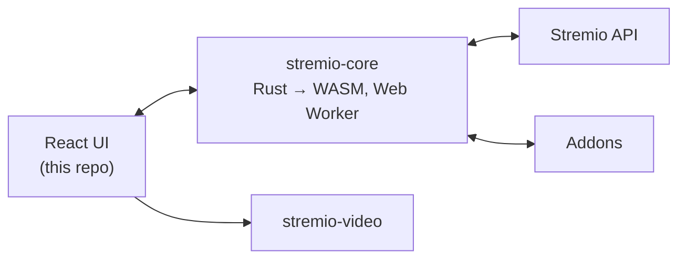

<div align="center">


# WTSH

**Just Watch** — a personal fork of [Stremio Web](https://github.com/Stremio/stremio-web) with a redesigned UI, running on the same addon-powered engine.

[](https://wtsh.vercel.app)
[](/LICENSE.md)

**[🌐 Open WTSH](https://wtsh.vercel.app)** · [Upstream project](https://github.com/Stremio/stremio-web) · [Report a bug](https://github.com/Mohamedattiadev/WTSH-STREAMIO_FORK/issues/new)

</div>

## ✨ Features

- 🧩 **Addon-powered** — discover movies, series and channels from catalogs provided by addons
- 🔄 **Sync everywhere** — your library and Continue Watching follow your Stremio account across devices
- 📺 **Casting** — play on the big screen via Chromecast
- 💬 **Subtitles** — addon-provided or local, with customizable styling
- ⌨️ **Keyboard-first player** — full playback control without touching the mouse
- 🌍 **50+ languages** — community-translated via [stremio-translations](https://github.com/Stremio/stremio-translations)
- 📱 **Installable** — runs as a standalone PWA

## 🛠 How it works

The UI (this repo) is a React app, but the brains live in [stremio-core](https://github.com/Stremio/stremio-core) — Stremio's Rust engine compiled to WebAssembly and running in a Web Worker. The UI renders state, the core computes it. Playback goes through [stremio-video](https://github.com/Stremio/stremio-video), which picks the right player implementation for the environment.



Actual playback requires a **Streaming Server** running somewhere reachable by the browser (locally or self-hosted) — see below.

## 🚀 Getting started

You'll need [Node.js](https://nodejs.org) 22+ and [pnpm](https://pnpm.io/installation) 11+.

```bash
pnpm install
pnpm start
```

The dev server runs at `http://localhost:8080`.

| Command | Description |
|---|---|
| `pnpm start` | Development server with hot reload |
| `pnpm run start-prod` | Development server in production mode |
| `pnpm run build` | Production build |
| `pnpm test` | Run tests |
| `pnpm run test:cache` | Run the cache-layer tests |
| `pnpm run benchmark:cache` | Cache before/after benchmark |
| `pnpm run lint` | Lint the source |
| `pnpm run scan-translations` | Check for missing translation keys |

### ⚡ Cache / proxy layer

The serverless functions in `api/` (TMDB reviews & hero-enrichment, and the first-party
addon's OpenSubtitles / Internet Archive / TMDB calls) sit behind a hot cache with request
coalescing, stale-while-revalidate and a negative cache — see **[docs/CACHING.md](/docs/CACHING.md)**.
It needs no setup locally (in-memory by default). For a real Redis hot cache: `docker compose up -d`
then set `UPSTASH_REDIS_REST_URL=http://localhost:8079` / `UPSTASH_REDIS_REST_TOKEN=local-dev-token`.
In production, add **Upstash Redis** from the Vercel Marketplace and it wires itself.

### 🐳 Docker

```bash
docker build -t wtsh .
docker run -p 8080:8080 wtsh
```

### 📡 Streaming Server

Playback needs the [Stremio Streaming Server](https://github.com/Stremio/server-docker) running and reachable from the browser. `scripts/stremio-server-setup/` has a one-command installer that sets up Docker (if missing), runs the server, and opens a public URL via a Cloudflare Tunnel:

```bash
# macOS / Linux
curl -fsSL https://raw.githubusercontent.com/Mohamedattiadev/WTSH-STREAMIO_FORK/stremio-server-setup/scripts/stremio-server-setup/install.sh | bash
```

```powershell
# Windows (PowerShell)
irm https://raw.githubusercontent.com/Mohamedattiadev/WTSH-STREAMIO_FORK/stremio-server-setup/scripts/stremio-server-setup/install.ps1 | iex
```

Paste the URL it prints into **Settings → Streaming → Add URL**.

## 🧩 Ecosystem

| Repository | What it is |
|---|---|
| [stremio-core](https://github.com/Stremio/stremio-core) | Rust engine: state, addon protocol, library, sync |
| [stremio-video](https://github.com/Stremio/stremio-video) | Video player abstraction used by this UI |
| [stremio-translations](https://github.com/Stremio/stremio-translations) | Community translations |
| [server-docker](https://github.com/Stremio/server-docker) | The Streaming Server, dockerized |

## 📄 License

Copyright © 2017-2026 Smart Code OOD. Released under the GPL-2.0 license — see [LICENSE](/LICENSE.md). This is an unofficial fork of [Stremio/stremio-web](https://github.com/Stremio/stremio-web); it isn't affiliated with or endorsed by Smart Code OOD.
